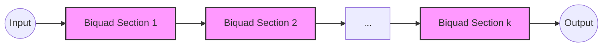

# chebyshev-engine

[](https://www.rust-lang.org)
[](#)
[](https://opensource.org/licenses/MIT)

`chebyshev-engine` is a production-grade, high-performance digital signal processing library for Rust. It implements Chebyshev filters (Type I & II) using **Cascaded Second-Order Sections (SOS/Biquads)** for maximum numerical stability and performance.

## Key Features

- **Production-Grade Architecture**: Decomposes high-order filters into stable Biquad cascades.
- **Direct Form II Transposed**: Implementation optimized for numerical precision and reduced state storage.
- **High Performance**: Leverages Rust iterators for guaranteed LLVM auto-vectorization (SIMD).
- **Embedded Ready**: `no_std` compatible, zero allocations in the signal path.
- **Precision Agnostic**: Generic `SignalProcessor` trait supports both `f32` (speed) and `f64` (precision).

## Mathematical Foundation

The transfer function $H(z)$ for the cascaded filter is defined as the product of $N/2$ second-order sections:

$$H(z) = \prod_{k=1}^{N/2} \frac{b_{0k} + b_{1k}z^{-1} + b_{2k}z^{-2}}{1 + a_{1k}z^{-1} + a_{2k}z^{-2}}$$

This architecture avoids the extreme coefficient sensitivity found in high-order Direct Form I/II implementations.

## Signal Flow (Biquad Cascade)



## Usage

### Adding to Cargo.toml
```toml
[dependencies]
chebyshev-engine = { git = "https://github.com/ashishrai12/Chebyshev_Filter_Test" }
```

### Basic Example
```rust
use chebyshev_engine::{Biquad, BiquadCascade, BiquadCoefficients, SignalProcessor};

// Initialize coefficients for a 4th order filter (2 sections)
let coeffs = BiquadCoefficients { 
    b0: 0.1, b1: 0.2, b2: 0.1, 
    a1: -0.5, a2: 0.1 
};

let mut filter = BiquadCascade::new([
    Biquad::new(coeffs),
    Biquad::new(coeffs),
]);

// Process a block of audio
let input = [1.0, 0.0, -1.0, 0.0];
let mut output = [0.0; 4];
filter.process_block(&input, &mut output);
```

### CLI Tool
Process WAV files directly:
```bash
cargo run --bin chebyshev-cli input.wav output.wav
```

## Performance (Benchmarks)
Run the benchmark suite to compare the Cascade implementation against a naive implementation:
```bash
cargo bench
```

## Legacy Visualization
Below is the visualization from the original MATLAB prototyping phase:


---
*Developed for medical/aerospace grade signal processing where safety and precision are paramount.*
